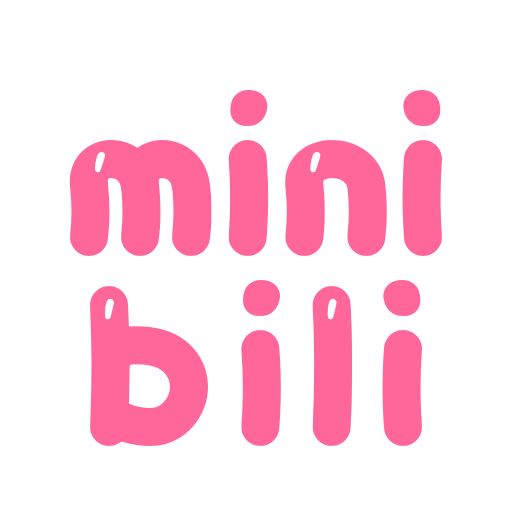
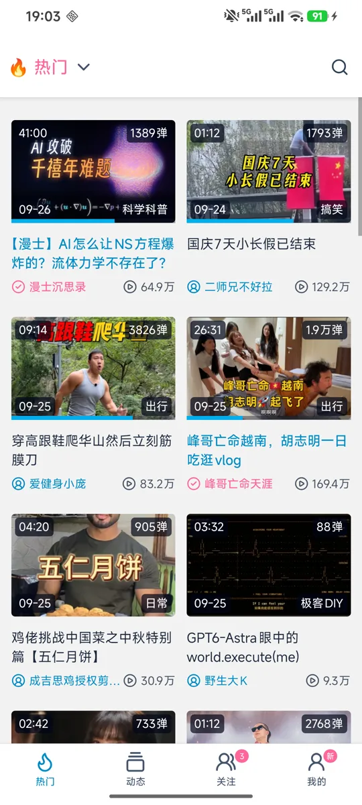
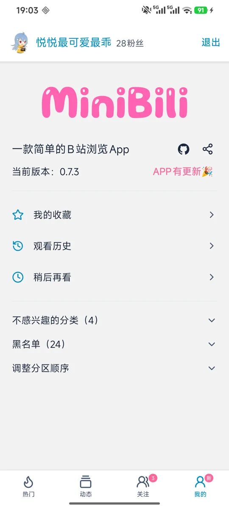

# MiniBili

一款简洁、免费开源的第三方 B 站 Android App。没有推荐、广告和推送，只有好看的视频和你喜爱的 UP 主。



   

下载安装：https://minibili.tingyuan.in/ （Android 6.0 及以上）

## 主要功能

- 热门、动态、关注、我的四个页面，浏览与搜索视频、UP 主
- 播放器支持弹幕、倍速、后台播放，直播与分 P 视频也能看
- 收藏、历史、稍后再看，UP 主主页与关注动态
- B 站账号登录，支持多账号与设置同步
- 视频分享页，支持深色模式

## 本地运行

需要 Node.js 与 npm，安装依赖后分别启动接口服务和客户端：

```bash
npm install
npm run server   # 本地接口服务
npm run dev      # 客户端开发服务（另开一个终端）
```

## 反馈与致谢

问题与建议欢迎通过 App 内的「意见反馈」或 GitHub Issue 提出。

接口文档来自 [bilibili-API-collect](https://socialsisteryi.github.io/bilibili-API-collect/)，感谢原作者。
